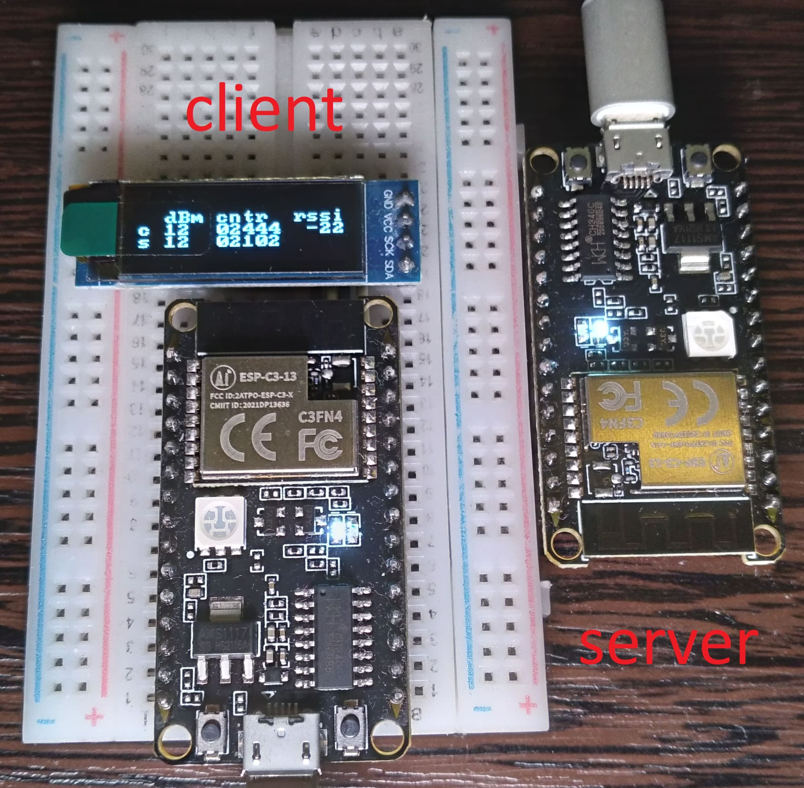

ESP32C3 NimBLE server example
====================

This example based on [SIMS-IOT-Devices / FreeRTOS-ESP-IDF-BLE-Server](https://github.com/SIMS-IOT-Devices/FreeRTOS-ESP-IDF-BLE-Server). Added features:

* Disconnect event handler. You don't need to restart your device when connection is lost

* Simple protocol through structure with counter and transmit power change (according to client power change)

This example works with the [ESP32C3 NimBLE client example]()
